# 👣 로그 수집과 모니터링 구축기

# 1. 로그

---

로그(log)란 시스템이나 애플리케이션에서 발생하는 사건이나 상태를 기록한 데이터를 의미합니다. 로깅(logging)은 로그를 수집하는 행위입니다.
개발에서 로깅은 중요합니다. 특히, 에러 상황을 빠르게 인지하고 디버깅하는데 용이합니다. 이밖에도 성능 분석, 이상 탐지, 사용자 행동 분석 등 보안과 비즈니스에도 활용될 수 있습니다.
오디 앱을 개발하면서 경험한 로깅과 모니터링 구축 과정을 공유하겠습니다.

# 2. 로그 데이터 수집

---

오디 앱 개발 단계에서의 로그 데이터 용도는 디버깅과 성능 분석이었습니다. 특히 AN과 BE가 함께 QA 하는 과정에서 적절한 로그를 남길 필요성을 느꼈습니다. 정상/비정상적인 데이터를 담아 요청할 때, 예상치 못한
에러를 발견하는 경우가 많았습니다. 이 때마다 IDE에서 디버깅 모드로 실행시켜 에러 상황을 재연해야 했습니다. 따라서 기본적으로 API로 들어오는 Request와 Response를 로깅하기로 했습니다.

## Request, Response 로그 수집하기

### 방법1) Controller에서 로그 찍기

가장 간단한 방법은 각 Controller에서 request과 response를 로그를 남기는 것입니다.

```java

@Override
@PostMapping("/v1/meetings")
public ResponseEntity<MeetingSaveResponseV1> saveV1(
        @AuthMember Member member,
        @Valid @RequestBody MeetingSaveRequestV1 meetingSaveRequestV1
) {
    log.info("request - {}", meetingSaveRequestV1);
    MeetingSaveResponseV1 meetingSaveResponseV1 = meetingService.saveV1(meetingSaveRequestV1);
    log.info("response - {}", meetingSaveResponseV1);
    return ResponseEntity.status(HttpStatus.CREATED)
            .body(meetingSaveResponseV1);
}
```

그러나, 이 방법은 모든 controller에 request, response 로그 코드가 추가됩니다. 똑같은 코드를 모든 controller 코드에 추가해야 하니, 여간 번거로운 작업이 아닙니다. 또한 로깅 관련
수정사항이 생길 때마다, 모든 controller 파일을 수정해야 하는 불편함이 있습니다.

### 방법2) Interceptor에서 로그 찍기

Controller를 거치기 전에 Interceptor에서 한 번에 로그를 찍을 수 있습니다.
이를 위해 `org.pringframework.web.servlet` 패키지의 `HandlerInterceptor`을 `implements` 해야 합니다.
HandlerInterceptor 인터페이스는 3가지 메서드가 있습니다.

```java
public interface HandlerInterceptor {
    default boolean preHandle(HttpServletRequest request, HttpServletResponse response, Object handler)
            throws Exception {
        return true;
    }

    default void postHandle(HttpServletRequest request, HttpServletResponse response, Object handler,
                            @Nullable ModelAndView modelAndView) throws Exception {
    }

    default void afterCompletion(HttpServletRequest request, HttpServletResponse response, Object handler,
                                 @Nullable Exception ex) throws Exception {
    }
}
```

- preHandle : Handler 실행 전 호출
    - true 반환 : 실행 체인이 다음 인터셉터 or 핸들러로 진행해야 하는 경우
    - false 반환 : 해당 인터셉터가 이미 응답을 처리
- postHandle : Handler 실행 후 호출
- afterCompletion : 뷰 생성 후 호출
    - `Exception ex` : 핸들러 실행 시 발생한 모든 예외. 처리된 예외는 포함되지 않음

<figure>
    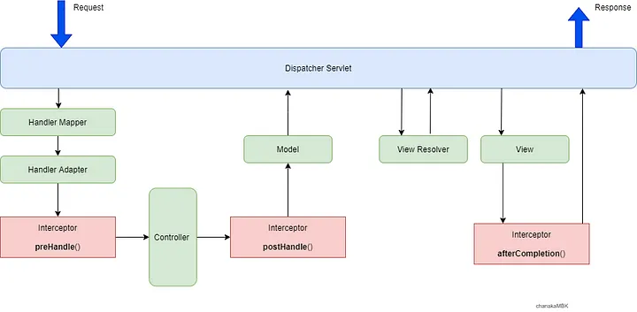
    <figcaption>출처 : https://medium.com/geekculture/what-is-handlerinterceptor-in-spring-mvc-110681604bd7</figcaption>
</figure>

### 🚨 Stream을 소모하지 않고 Body 찍기

`HttpServletRequest`, `HttpServletResponse` 에서 요청된 URI나 응답 코드를 가져오는 것은 간단합니다.
문제는 인터셉터에서 body를 가져오는 것입니다. body를 가져오기 위해서는 전달된 InputStream과 OutputStream을 사용해야 하는데, Stream은 일회성이므로 인터셉터에서 Stream을 소모할 수
없었습니다.
Stream을 소모하지 않고 읽어오려면 어떻게 해야 할까요? 캐싱으로 해결할 수 있었습니다.

### `ContentCachingRequestWrapper`

스프링에서 Stream과 Reader에서 데이터를 읽고 캐싱해두는 Wapper 클래스를 제공하고 있습니다.

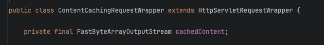
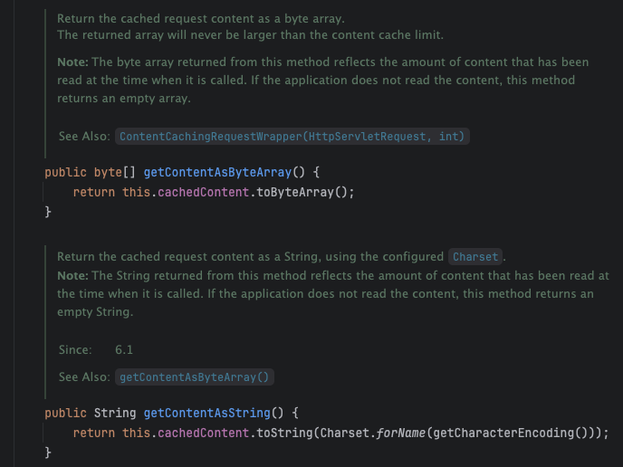

캐싱해둔 콘텐츠(데이터)를 `byte[]` 혹은 `String` 타입으로 가져올 수 있습니다.

### `ContentCachingResponseWrapper`

ResponseWapper도 존재합니다.

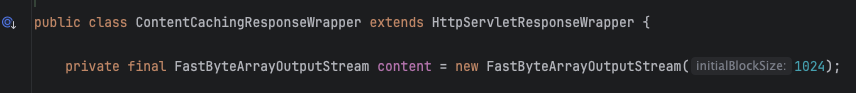
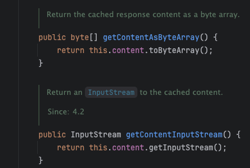

단, `ContentCachingRequestWrapper`와 달리, `byte[]`, `InputStream`으로 캐싱된 콘텐츠를 가져올 수 있습니다.
String으로 바로 body를 가져올 수 있는 메서드가 없습니다. 이 점이 불편하다면, ContentCachingResponseWrapper를 상속하는 커스텀 Wrapper를 만들거나,
HttpServletResponseWrapper를 상속하여 커스텀할 수 있습니다.

### doFilter

Wrapper를 사용하는 방법은 간단합니다. Interceptor보다 이전에, 캐싱해주면 됩니다. Interceptor 전에 호출되는 Filter에서 구현했습니다.

```java

@Component
public class CustomFilter implements Filter {

    @Override
    public void doFilter(ServletRequest servletRequest, ServletResponse servletResponse, FilterChain filterChain)
            throws IOException, ServletException {
        ContentCachingRequestWrapper requestWrapper = new ContentCachingRequestWrapper(
                (HttpServletRequest) servletRequest
        );
        ContentCachingResponseWrapper responseWrapper = new ContentCachingResponseWrapper(
                (HttpServletResponse) servletResponse
        );
        filterChain.doFilter(requestWrapper, responseWrapper); // 요청을 다음 Filter나 서블릿에 전달
        responseWrapper.copyBodyToResponse(); // Copy the complete cached body content to the response.
    }
}
```

filterChain.doFilter 이후 `responseWrapper.copyBodyToResponse();` 를 반드시 써야 합니다.
모든 서블릿 컨테이너의 작업이 끝나고, 클라이언트에게 응답할 때에도 copy를 해줘야 하기 때문입니다. 이 코드가 없으면 클라이언트는 아무런 응답을 받을 수 없습니다.

<figure>
    
    <figcaption>Response body가 없습니다.</figcaption>
</figure>

Interceptor 코드입니다.

Filter를 통해 Wapper 된 Request, Response를 다시 ContentCachingXXXWrapper로 캐스팅하고,

`new String(xxxWrapper.getContentAsByteArray())` 로 캐싱된 body를 출력합니다.

```java

@Slf4j
@Component
public class LoggingInterceptor implements HandlerInterceptor {

    @Override
    public void afterCompletion(HttpServletRequest request, HttpServletResponse response, Object handler, Exception ex)
            throws Exception {
        ContentCachingRequestWrapper requestWrapper = (ContentCachingRequestWrapper) request;
        ContentCachingResponseWrapper responseWrapper = (ContentCachingResponseWrapper) response;

        // ... 500번대 로깅
        // ... 400번대 로깅

        if (responseWrapper.getStatus() >= 200) {
            log.info("[Request] {} {}, Query: {}, Headers: {}, Body: {} [Response] {}, Body: {}",
                    requestWrapper.getMethod(),
                    requestWrapper.getRequestURI(),
                    requestWrapper.getQueryString(),
                    requestWrapper.getHeader(HttpHeaders.AUTHORIZATION),
                    new String(requestWrapper.getContentAsByteArray()),
                    responseWrapper.getStatus(),
                    new String(responseWrapper.getContentAsByteArray())
            );
        }
    }
}
```

### 결과

Interceptor에서 요청과 응답 body를 한번에 로깅할 수 있습니다.

```
2024-08-19 00:10:55.723 [INFO] [http-nio-8080-exec-2] [c.o.c.interceptor.LoggingInterceptor] - [Request] POST /v1/meetings, Query: null, Headers: Bearer device-token=test, Body: {"name": "개글스 리뷰타임","date": "2024-08-19","time": "16:00","targetAddress": "서울 송파구 올림픽로35다길 42","targetLatitude": "37.515298","targetLongitude": "127.103113"} [Response] 201, Body: {"id":1,"name":"개글스 리뷰타임","date":"2024-08-19","time":"16:00","targetAddress":"서울 송파구 올림픽로35다길 42","targetLatitude":"37.515298","targetLongitude":"127.103113","inviteCode":"testInviteCode"}
```

### 참고) Filter의 동작 원리

그림으로 동작 원리를 살펴보겠습니다.

<figure>
    
    <figcaption>출처 : https://gngsn.tistory.com/153</figcaption>
</figure>

그림에서 doFilter가 2번 쓰여있는데, doFilter가 2번 호출되는 건가 싶었는데, 아니었습니다. doFilter 코드 내에서 재귀 호출이 일어납니다.

`filterChain.doFilter()` 전에는 DispatcherServlet을 거치기 전 (1)doFilter 코드가 수행되고 후에는 DispatcherServlet을 거친 후 (2)doFilter 코드가
수행됩니다.

<details>
    <summary>doFilter 코드 참고</summary>
    <pre><code>
@Override
public void doFilter(ServletRequest servletRequest, ServletResponse servletResponse, FilterChain filterChain)
        throws IOException, ServletException {
    **System.out.println(">>>> Filter - doFilter");**
    ContentCachingRequestWrapper requestWrapper = new ContentCachingRequestWrapper(
           (HttpServletRequest) servletRequest
    );
    ContentCachingResponseWrapper responseWrapper = new ContentCachingResponseWrapper(
            (HttpServletResponse) servletResponse
    );
    filterChain.doFilter(requestWrapper, responseWrapper); // 요청을 다음 Filter나 서블릿에 전달
    responseWrapper.copyBodyToResponse(); // Copy the complete cached body content to the response.
    **System.out.println("<<<< Filter - doFilter");**
}
    </code></pre>
</details>

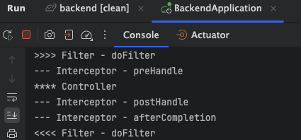

# 3. 로그 저장 및 대시보드 구축

---

로그 데이터를 수집했다면, 어떻게 보여줄 것인지를 결정해야 합니다. 로그 대시보드를 구축하지 않으면, 모니터링을 할 때마다 매번 서버 콘솔에 접속하여 로그 파일을 열어봐야 합니다. 오디 팀에서는 지정된 IP가 아니면
SSH로 서버 접속이 불가능한 보안 정책을 준수하고 있습니다. 따라서 어디서든 로그를 확인하려면 대시보드 구축이 필수적이었습니다.

로깅 프레임워크로는 Logback, 대시보드 구축에는 CloudWatch를 선택했습니다.

기술을 선택하는 데 최우선으로 러닝 커브를 고려했습니다. Spring Boot 기본 스펙인 Logback 프레임워크와, 이미 인프라 구축에 사용하고 있는 AWS 서비스를 사용하기로 했습니다.

## 로그 파일 생성

로그 대시보드를 구축하려면 로그 파일 생성이 선행되어야 합니다.
오디 팀은 EC2 내부에서 docker 이미지를 실행시켜 Spring Boot를 띄웁니다. 로그 파일은 여기에 있습니다.

```bash
sudo cat /var/lib/docker/containers/{컨테이너 ID}/{컨테이너 ID}-json.log
```

도커를 실행시킬 때, 기본적으로 log driver는 json-file로 설정됩니다. 결과적으로, 다음과 같은 이유로 로그 파일을 직접 생성해주기로 했습니다.

1. 로그 파일 이름을 특정할 수 없었습니다. 컨테이너 ID가 이름에 붙기 때문에, CloudWatch Agent config에서 `file-path`를 특정할 수 없습니다.
2. json-file로 생성된 로그는 json 형태로 보여져 가독성이 좋지 않았습니다.

### 참고) awslogs

CloudWatch Agent config 설정과 관계 없이, 간단하게 로그 파일을 전송할 수 있는 방법도 있습니다.
docker 이미지를 실행시키는 명령어에 log-driver를 awslogs로 지정합니다.
단, 로그 그룹 이름은 지정해줄 수 있었지만 로그 스트림 이름을 지정하는 방법을 찾지 못했습니다.

```bash
docker run \
    --log-driver=awslogs \
    --log-opt awslogs-region=ap-northeast-2 \
    --log-opt awslogs-group=ody-logs \
    --log-opt awslogs-create-group=true \
    ...
```

1개의 로그 그룹 하위에 1개의 로그 스트림이 생성되는 형태를 원했기 때문에, 해당 방법을 사용하지 않았습니다.

### Logback 프레임워크

Spring Boot 기본 스펙이기 때문에 의존성 추가는 불필요합니다. `프로젝트 > src > main > resources > logback-spring.xml` 파일을 생성합니다.

아래는 INFO 레벨에 해당하는 로그만 필터링하여, `${LOG_FILE_PATH}/ody-dev-info.log`에 파일을 생성하는 코드입니다.

```xml
<?xml version="1.0" encoding="UTF-8" ?>

<configuration>
    <springProperty scope="context" name="LOG_FILE_PATH" source="log.file.path"/>

    <appender name="ODY_DEV_INFO" class="ch.qos.logback.core.rolling.RollingFileAppender">
        <file>${LOG_FILE_PATH}/ody-dev-info.log</file>
        <rollingPolicy class="ch.qos.logback.core.rolling.FixedWindowRollingPolicy">
            <fileNamePattern>${LOG_FILE_PATH}/ody-dev-info.%i.log.zip</fileNamePattern>
            <minIndex>1</minIndex>
            <maxIndex>2</maxIndex>
        </rollingPolicy>
        <triggeringPolicy class="ch.qos.logback.core.rolling.SizeBasedTriggeringPolicy">
            <maxFileSize>500MB</maxFileSize>
        </triggeringPolicy>
        <filter class="ch.qos.logback.classic.filter.LevelFilter">
            <level>INFO</level>
            <onMatch>ACCEPT</onMatch>
            <onMismatch>DENY</onMismatch>
        </filter>
        <encoder>
            <pattern>
                %d{yyyy-MM-dd HH:mm:ss.SSS} [%level] [%thread] [%logger{36}] - %msg%n
            </pattern>
        </encoder>
    </appender>

    <root level="INFO">
        <appender-ref ref="ODY_DEV_INFO"/>
    </root>
</configuration>
```

### 🚨 버그 픽스

처음에는 파일을 상대 경로(`./ody-dev-logs/ody-dev-info.log`)로 설정했었습니다. 로컬에서는 루트 디렉토리 하위에 잘 생성이 되었지만, EC2 내에서 docker 실행 시에 오류가 났습니다.

로컬에서는 `./` 가 root를 가리키고 있지만, docker에서는 jar 파일 내부를 가리키고 있었습니다. 로컬과 EC2의 경로를 다르게 설정해줘야 합니다. springProperty를 사용하여 경로를 다르게
지정해줄 수 있었습니다.

application.yml에 아래 코드를 추가하여 해결했습니다.

```yaml
spring:
  profiles:
    active: dev

---

spring:
  config:
    activate:
      on-profile: local

log:
  file:
    path: ./ody-dev-logs

---

spring:
  config:
    activate:
      on-profile: dev

log:
  file:
    path: /ody-dev-logs
```

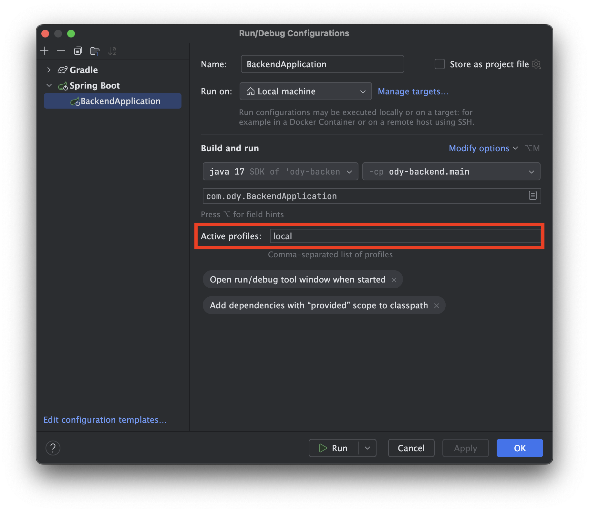

로컬에서는 local profile을 활성화하고, 아니면 dev profile을 활성화합니다.

### Docker Volume 지정

로그 파일 생성에 성공했으나, 지금은 로그 파일이 docker 컨테이너 내부에만 쌓이고 있습니다. 다음과 같은 이유로 Volume을 설정했습니다.

1. EC2에서는 docker 컨테이너에 직접적으로 접근이 불가능합니다. 즉, CloudWatch Agent는 docker 내부에 직접 접근하지 못해 로그 파일을 가져올 수 없습니다.
2. docker 컨테이너에 저장된 데이터는 컨테이너가 내려가면 삭제됩니다. 즉, 컨테이너가 종료되면 로그 파일이 삭제됩니다.

Volume을 지정하여 EC2 내부와 docker 컨테이너를 연결했습니다. docker run 명령어 실행 시에 설정할 수 있습니다.

```bash
docker run -d --platform linux/arm64 --name $DOCKER_CONTAINER_NAME -v /var/logs/ody-dev-logs:/ody-dev-logs -p 80:8080 ${{ secrets.DOCKERHUB_USERNAME }}/$DOCKERHUB_REPOSITORY:${{ github.sha }}
```

`-v /var/logs/ody-dev-logs:/ody-dev-logs`

EC2의 `/var/logs/ody-dev-logs` 디렉토리와 docker 컨테이너의 `/ody-dev-logs` 디렉토리를 동기화합니다.

해당 docker 컨테이너에 로그 파일이 생성/변경되면, 연결된 EC2 디렉토리에도 변경사항이 반영됩니다.

반대로, EC2 디렉토리 내 수정이 생기면, 컨테이너 디렉토리도 수정됩니다.

⇒ 이러한 원리로 docker 컨테이너 삭제되고 새롭게 생성될 때, 연결된 EC2 디렉토리에 있는 데이터가 컨테이너에도 생성되어 데이터가 유지됩니다.

## CloudWatch 대시보드 구축

CloudWatch 대시보드를 구축하는 것은 매우 간단합니다.

`AWS 콘솔에서 > CloudWatch 검색 > 대시보드 > 대시보드 생성` 버튼으로 만들 수 있습니다.

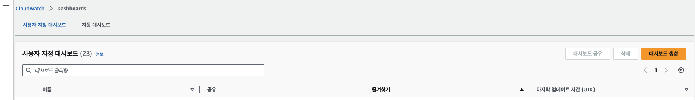

단, 대시보드 생성은 유료 서비스입니다. 사용자 지정 대시보드에 대해서 월별 대시보드당 USD 3.00 비용이
듭니다. [요금 참고](https://aws.amazon.com/ko/cloudwatch/pricing/)
CloudWatch에서 기본으로 제공하는 지표는 CPUUtilization, NetworkIn, NetworkOut 등이
있습니다. [지표 참고](https://docs.aws.amazon.com/ko_kr/AWSEC2/latest/UserGuide/viewing_metrics_with_cloudwatch.html)

그러나 기본 지표로는 로그를 모니터링 할 수 없고, 로그 수집을 위해 CloudWatch Agent가 필요합니다.

### CloudWatch Agent

**역할 설정**

Agent를 통해 지표를 수집하기 전에, IAM 역할을 추가해야 합니다.

`AWS 콘솔 > IAM > 역할 > 역할생성 > AWS 서비스, EC2 선택 > CloudWatchAgentServerPolicy 추가`

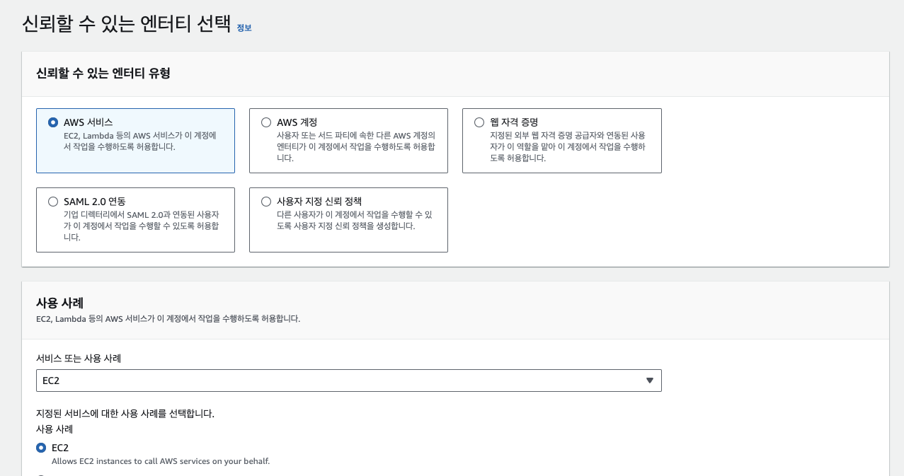
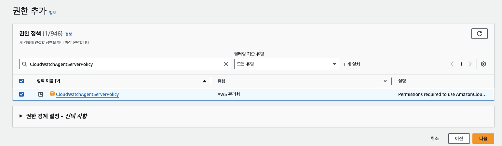

역할을 생성했으면, 적용합니다.

`EC2 인스턴스 선택 > 보안 > IAM 역할 수정 > 추가한 역할 이름 입력하여 추가`

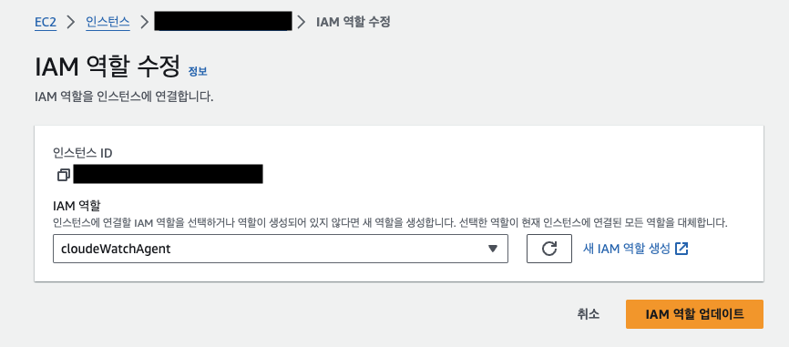

**설치**

설치는 CLI 명령어로 간단하게 할 수 있습니다.

EC2 인스턴스 서버에 접속하여 아래 명령어를 입력합니다. OS에 맞는 명령어가
다르니, [공식 문서](https://docs.aws.amazon.com/ko_kr/AmazonCloudWatch/latest/monitoring/download-cloudwatch-agent-commandline.html)
를 참고해야 합니다. 아래는 ARM64 Ubuntu 기준 명렁어입니다.

```bash
wget https://amazoncloudwatch-agent.s3.amazonaws.com/ubuntu/arm64/latest/amazon-cloudwatch-agent.deb
sudo dpkg -i -E ./amazon-cloudwatch-agent.deb
```

### 🚨 버그 픽스

아래와 같은 로그가 떠서 설치가 안 된다면, EC2 스토리지를 확인해야 합니다.

```bash
dpkg: error processing archive ./amazon-cloudwatch-agent.deb (--install):
cannot copy extracted data for 'opt/aws/amazon-cloudwatch-agent/bin/start-amazon-cloudwatch-agent' to '/opt/aws/amazon-cloudwatch-agent/bin/start-amazon-cloudwatch-agent.dpkg-new': failed to write (No space left on device)
dpkg-deb: error: paste subprocess was killed by signal (Broken pipe)
Errors were encountered while processing:
 ./amazon-cloudwatch-agent.deb
```

t4g.micro에 8GBi를 사용하고 있었는데, 16GBi로 업그레이드 하여 해결했습니다.
Agent를 설치했다면, 설정을 해줘야 합니다.
config 파일을 직접 생성 할 수도 있고, wizard를 통해 생성할 수도 있습니다. config 파일에 문법 실수나 오류가 있다면 동작하지 않습니다. 디버깅이 쉽지 않으니, wizard를 추천합니다.

wizard를 통해 설정하는 명령어입니다.

```bash
sudo /opt/aws/amazon-cloudwatch-agent/bin/amazon-cloudwatch-agent-config-wizard
```

wizard를 사용하면, 질문이 끝없이 올라옵니다. 질문에 끝까지 답하면, config 파일이 생성됩니다.

<figure>
    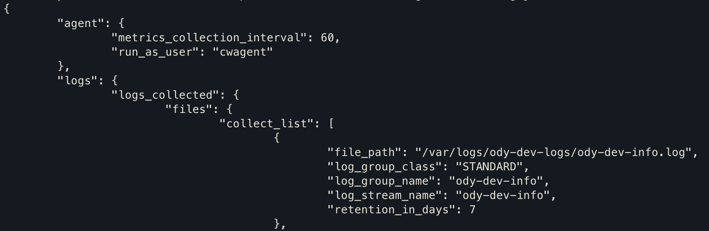
    <figcaption>CLI 명령어 : sudo cat /opt/aws/amazon-cloudwatch-agent/bin/config.json</figcaption>
</figure>

`/var/logs/ody-dev-logs/ody-dev-info.log`에 있는 로그 파일을 수집한다는 의미입니다.

여기서 로그 그룹(`log_group`)은 로그 스트림(`log_stream`)을 관리하는 단위입니다. 로그 스트림은 로그 이벤트(로그 한 줄)의 모음입니다.

config 파일을 설정했다면, 실행합니다.

```bash
sudo /opt/aws/amazon-cloudwatch-agent/bin/amazon-cloudwatch-agent-ctl -a fetch-config -s -m ec2 -c file:/opt/aws/amazon-cloudwatch-agent/bin/config.json
```

아래 명령어로 동작 상태를 확인할 수 있습니다.

```bash
sudo /opt/aws/amazon-cloudwatch-agent/bin/amazon-cloudwatch-agent-ctl -m ec2 -a status
```

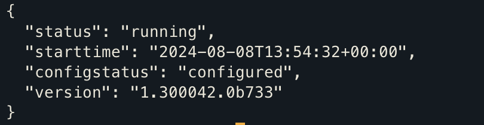

이제, AWS에서 로그 그룹이 생성되었는지 확인합니다.

`AWS 콘솔 > CloudWatch > 로그 그룹 > 지정한 로그 그룹 이름으로 검색`

로그 그룹이 생성되지 않았다면 IAM 역할이 잘 적용되었는지, agent config 파일에 오류가 없는지 확인해야 합니다. CloudWatch의 로그를 통해 오류를 확인해 볼 수 있습니다.

```bash
tail -f /opt/aws/amazon-cloudwatch-agent/logs/amazon-cloudwatch-agent.log
```

# 참고

- [Amazon - CloudWatch](https://docs.aws.amazon.com/ko_kr/AmazonCloudWatch/latest/monitoring/WhatIsCloudWatch.html)
- [Spring docs - HandlerInterceptor](https://docs.spring.io/spring-framework/docs/current/javadoc-api/org/springframework/web/servlet/HandlerInterceptor.html)
- [Baeldung - HandlerInterceptor](https://www.baeldung.com/spring-mvc-handlerinterceptor)
- [Spring docs - ContentCachingRequestWrapper](https://docs.spring.io/spring-framework/docs/current/javadoc-api/org/springframework/web/util/ContentCachingRequestWrapper.html)
